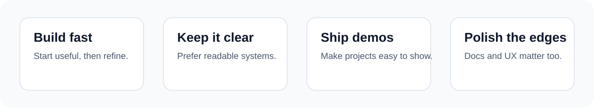

# Abdul Salam

**Software developer building practical tools for operations, research, and business workflows.**

I like turning messy real-world processes into simple products that people can actually use.
That usually means web apps, internal tools, automations, APIs, and data-heavy workflows.

## Find me online

## Quick snapshot

- based in London
- available for freelance product builds and internal tools
- strongest in Python, TypeScript, APIs, and product polishing
- happiest when turning scattered workflows into something clean and repeatable

## What I build

- contractor and admin workflow tools
- document-heavy web products
- search and filtering interfaces
- APIs for structured records
- scraping and data collection pipelines
- clean MVPs that can become real products

## Selected work

### [timesheet-invoice](https://github.com/get2salam/timesheet-invoice)
A contractor invoicing workflow that turns shift logs into client-ready exports.

**Highlights**
- manual and OCR-assisted shift capture
- configurable invoice profiles and rates
- PDF, Excel, and CSV exports

### [legal-api](https://github.com/get2salam/legal-api)
An API-first backend for document search and structured record retrieval.

**Highlights**
- clean backend architecture
- search-oriented endpoints
- built for real data rather than toy examples

### [legal-scraper](https://github.com/get2salam/legal-scraper)
A scraping pipeline focused on collecting, cleaning, and structuring document-heavy sources.

**Highlights**
- modular scraping flow
- practical parsing logic
- designed for messy source material

## How I like to work

- ship useful things quickly
- keep interfaces simple
- prefer clarity over cleverness
- make products easy to demo and easy to extend
- treat documentation like part of the product

## Toolbox

### Languages

### Frontend

### Backend

### Data and infra

## Current direction

Right now I am focused on building stronger public proof of work:

- practical business tools
- cleaner product demos
- better documentation
- more visible GitHub consistency

## Best fit work

I am especially useful when a project needs:

- a fast MVP that still feels professional
- a boring but important workflow made easier
- a backend or internal tool that needs structure
- a data flow that has to survive messy inputs
- a repo that needs better presentation before clients see it

## Collaboration

I am open to:

- freelance builds
- internal tools and operations dashboards
- MVP development
- scraping and backend-heavy delivery work
- product cleanup before launch or client demos

## Contact

If you want help building a useful internal tool, a data workflow, or a polished MVP, feel free to reach out.

- LinkedIn: <https://www.linkedin.com/in/abdulsalam-ai/>
- Upwork: <https://www.upwork.com/freelancers/~017a6a583ee6ba698c>

---

